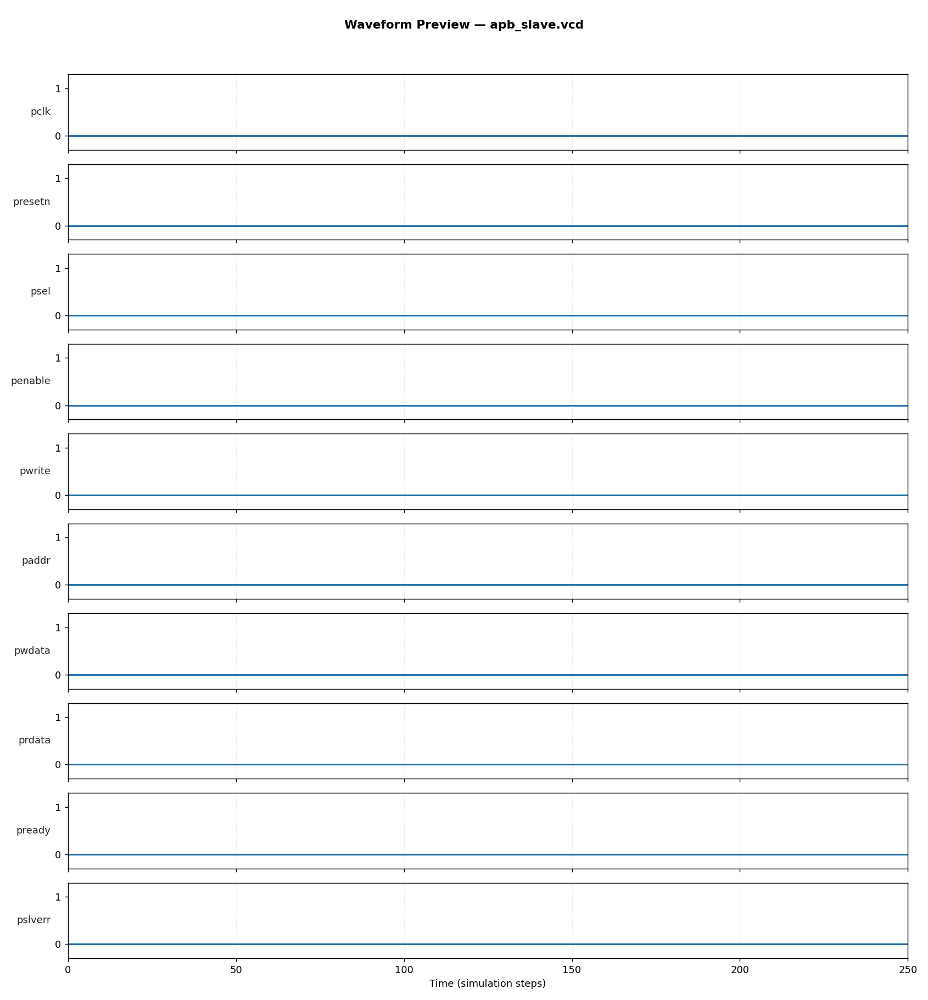

# AMBA-APB Slave Peripheral — RTL Design & Verification

**Author:** Abhijit Karale
**Tools used:** SystemVerilog (IEEE 1800-2012), Icarus Verilog 12.0, Python/Matplotlib


## Overview
An AMBA APB (Advanced Peripheral Bus, APB v2.0) slave peripheral implementing
the standard SETUP → ACCESS two-phase protocol state machine, with 4
memory-mapped 32-bit registers. APB is the de-facto standard for
low-bandwidth peripheral register access in ARM-based SoCs (UART, GPIO,
timers, interrupt controllers), making this a directly relevant building
block for embedded/SoC peripheral integration work.

- **Registers:** 4 x 32-bit (REG0–REG3), byte-addressed at 0x00/0x04/0x08/0x0C
- **Error response:** `PSLVERR` correctly asserted on out-of-range address access
- **Protocol:** full SETUP/ACCESS FSM per AMBA APB specification

## Block Diagram
```
   PSEL, PENABLE, PWRITE   ┌───────────────────┐
   PADDR, PWDATA  ───────▶ │   APB FSM          │
                           │  IDLE→SETUP→ACCESS │──▶ PREADY
                           └─────────┬──────────┘──▶ PSLVERR
                                     ▼
                           ┌───────────────────┐
                           │  4x32-bit Register │──▶ PRDATA
                           │       File          │
                           └───────────────────┘
```

## Verification Approach
Self-checking SystemVerilog testbench (`tb/tb_apb_slave.sv`) with:
- **Reference model:** shadow register array mirroring expected register contents
- **Directed tests:** write-then-read-back all 4 registers; out-of-range address error-response check
- **Constrained-random regression:** 200 randomized write/read transactions across all registers
- **Result: 206/206 checks passed, 0 failures**

During development, the initial testbench had an off-by-one clock-cycle bug
(dropping `PSEL` one edge too early, so the register file never captured the
write). Debugging this against the actual simulation waveform — rather than
just re-reading the RTL — is a good example of the kind of cycle-accurate
protocol timing debug that a DV role centers on; the fix and root cause are
left in the commit history / testbench comments for reference.

## Waveform


Full interactive waveform: `waveform/apb_slave.vcd` (open with GTKWave or any VCD viewer)

## How to Run
```bash
chmod +x run.sh
./run.sh
```
Requires: `iverilog`, `vvp` (Icarus Verilog), Python 3 with `matplotlib`.

## Repository Structure
```
02_amba_apb_slave/
├── rtl/apb_slave.sv           # synthesizable RTL (APB FSM + register file)
├── tb/tb_apb_slave.sv         # self-checking testbench
├── waveform/                  # VCD + PNG waveform preview
├── vcd_plot.py                # waveform plotting utility
└── run.sh                     # one-command build+sim+plot
```

## Skills Demonstrated
`SystemVerilog` `AMBA-APB Protocol` `RTL Design` `Functional Verification`
`Constrained-Random Testing` `Protocol-Level Timing Debug` `Register-Map Design`
